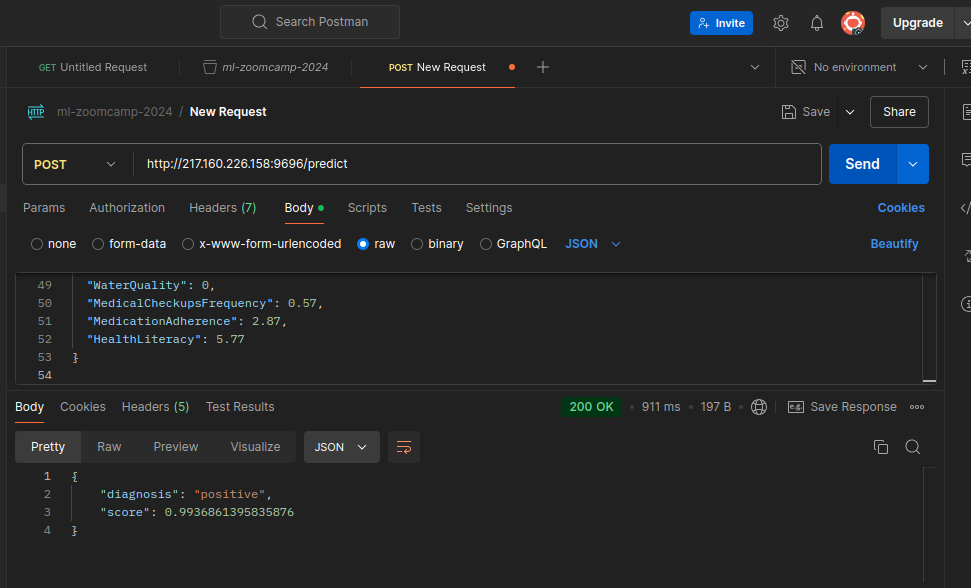

# Chronic Kidney Disease Prediction

This project implements a machine learning model to predict the risk of Chronic Kidney Disease (CKD) based on various patient features. It utilizes an XGBoost classifier for prediction, along with data pre-processing and model evaluation.

Data source: https://www.kaggle.com/datasets/rabieelkharoua/chronic-kidney-disease-dataset-analysis/data

## Problem Description

Chronic Kidney Disease (CKD) is a serious health condition that affects millions worldwide. Early detection and intervention are crucial for managing the disease and preventing complications. This project aims to develop a predictive model that can assist healthcare professionals in identifying individuals at high risk of CKD.

## Files

* **train.py:** Contains the code for training and saving the XGBoost model.
* **predict.py:** Contains a Flask API for making predictions using the trained model.
* **diagnosis.py** Contains functions to generate random patients data to test the model.
* **Pipfile:** Specifies project dependencies for Pipenv.
* **Pipfile.lock:** Locks dependency versions for consistent environments.
* **Dockerfile:** Defines the Docker image configuration for building and running the application.

## Instructions

### Using Docker

1. **Install Docker:**
   Make sure Docker is installed on your system. Follow instructions for your operating system from the official Docker website: [https://docs.docker.com/get-docker/](https://docs.docker.com/get-docker/)

2. **Build the Docker Image:**
   ```bash
   docker build -t chronic-kidney-disease-predictor .

3. **Run the Docker Container**:

docker run -p 9696:9696 chronic-kidney-disease-predictor


This will start the Flask API server on port 9696 within the Docker container. 

### Training

The `notebook.ipnyb` file contains:

- EDA - Exploratory data analysis with correlation and feature importance
- Training of diffent models: **Logistic regression**, **Random forest**, **Decision tree**, radient boosting with XGBoost**
- Models evaluation
- Code to save and load the model with Pickle 

### Prediction

The `diagnosis.py` file contains the functions to create random patients data for test prediction.

The functions have been written to create plausible data starting from the statistics deriving from the original data. 

There are two different functions:

- `generate_random_patient()` to generate a single patient
- `generate_multiple_patients(n=1)` to generate multiple patients. By changin the value of the `n` parameter you can decide how many patients you want to create.

Example of a generated random patient json data:

```
{'Age': 54, 'Gender': 0, 'Ethnicity': 1, 'SocioeconomicStatus': 2, 'EducationLevel': 2, 'BMI': 18.44, 'Smoking': 0, 'AlcoholConsumption': 10.14, 'PhysicalActivity': 6.99, 'DietQuality': 2.43, 'SleepQuality': 8.3, 'FamilyHistoryKidneyDisease': 1, 'FamilyHistoryHypertension': 0, 'FamilyHistoryDiabetes': 0, 'PreviousAcuteKidneyInjury': 0, 'UrinaryTractInfections': 0, 'SystolicBP': 150.34, 'DiastolicBP': 75.19, 'FastingBloodSugar': 74.6, 'HbA1c': 5.44, 'SerumCreatinine': 4.75, 'BUNLevels': 13.42, 'GFR': 57.54, 'ProteinInUrine': 4.28, 'ACR': 272.63, 'SerumElectrolytesSodium': 143.38, 'SerumElectrolytesPotassium': 4.54, 'SerumElectrolytesCalcium': 9.86, 'SerumElectrolytesPhosphorus': 3.93, 'HemoglobinLevels': 15.47, 'CholesterolTotal': 150.61, 'CholesterolLDL': 131.47, 'CholesterolHDL': 94.78, 'CholesterolTriglycerides': 125.26, 'ACEInhibitors': 0, 'Diuretics': 0, 'NSAIDsUse': 3.7, 'Statins': 0, 'AntidiabeticMedications': 0, 'Edema': 0, 'FatigueLevels': 2.39, 'NauseaVomiting': 3.51, 'MuscleCramps': 4.14, 'Itching': 2.2, 'QualityOfLifeScore': 72.72, 'HeavyMetalsExposure': 0, 'OccupationalExposureChemicals': 0, 'WaterQuality': 0, 'MedicalCheckupsFrequency': 0.57, 'MedicationAdherence': 2.87, 'HealthLiteracy': 5.77}
```

The `predict.py` file sends a request to a Flask app to get a jsonified response with a diagnosis.

Example of response:

```
{'diagnosis': 'positive', 'score': 0.9936861395835876}

```

### Deployment

The web service have been deployed on a Ionos VPS server using Docker.

The `diagnosis.py` file contains the request to the public url where the Flask service is deployed. 

The file generates a single patient json data, sends the request to the public IP and gets back a json with a predicted diagnosis. 

This is an example of a Postman request:

